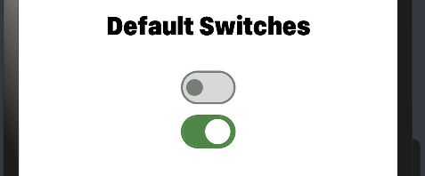

# Material_Switch

This library is developed to provide customizable toggle switches  implemented using extended typescript.

## Download & Install

Install using npm

```npm i @ohos-material-switch```


## Usage Instructions

1. Import files and code dependencies

```ets
import { Switch, SwitchModel }  from "@ohos/material-switch"
```

2. Initialize switch model data

```
private model: SwitchModel.Model = new SwitchModel.Model();
```

3. Code for creating default switch

```
this.model.reset()

Switch({
    model: this.model,
    onSelect: (id, isOn) => {
            prompt.showToast({
              message: id.toString()
    })
})
```



4. Code for creating custom switch with icon

```
    this.model.reset()
    this.model.setSwitchId(1)
    this.model.setWithIcon(true)
    this.model.setIsOn(true)
    this.model.setIcon($r('app.media.tick'))

Switch({
    model: this.model,
    onSelect: (id, isOn) => {
            prompt.showToast({
              message: id.toString()
    })
})
```


## Compatibility

Supports OpenHarmony API version 8

## Code Contribution

If you find any problems during usage, you can submit
an [Issue](https://github.com/Applib-OpenHarmony/Material_Ui_Switch/issues) to us. Of course, we also welcome you to
send us [PR](https://github.com/Applib-OpenHarmony/Material_Ui_Switch/pulls).

## Open source License

This project is based
on [Apache License 2.0](https://github.com/Applib-OpenHarmony/Material_Ui_Switch/blob/main/LICENSE), please enjoy and
participate in open source freely.

# Reference:

Design by : Amir Ahmed Imtiaz
